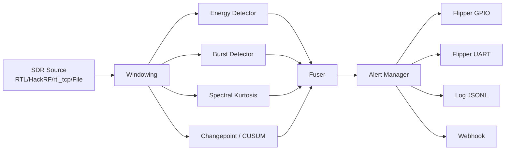

# 📡 Flipper Spectrum Defense Companion — *Pocket Jam/Intrusion Alarm*

[](#)
[](LICENSE)
[](#)
[](#)
[](#)
[](#)

A field‑friendly spectrum **watchdog**: your Pi or laptop monitors RF bands for anomalies (sudden spikes, CW jamming, repeated bursts).  
On detection, it **pings your Flipper Zero** (GPIO or UART) to vibrate, flash a custom animation, or trigger a legal IR/SubGHz “ping”.

> **Detect‑only**. No TX/jamming. Obey your local spectrum regulations.

---

## ✨ Highlights
- Modular **detectors**: energy thresholding, burst patterning, spectral kurtosis, simple CUSUM changepoint.
- **Cross‑platform**: RTL‑SDR, HackRF (via Soapy), rtl_tcp, or **offline IQ files** for testing.
- **Pocket mode**: Pi GPIO pulse -> Flipper vibrates + anim. Optional UART for rich alerts.
- **Batteries included**: systemd service, udev rules, install scripts, tests with sample IQ, readable logs (`JSONL`).

---

## 🚀 Quickstart (Raspberry Pi or Linux)
```bash
git clone https://example.com/flipper-spectrum-defense-companion.git
cd flipper-spectrum-defense-companion

# 1) Install system deps + Python deps
make install

# 2) Run a demo against a sample IQ file (no hardware needed)
make run PROFILE=demo_indoor DEVICE=file IQ=tests/data/sample_burst.npy

# 3) Run with an RTL-SDR at 868.3 MHz
make run PROFILE=field_patrol DEVICE=rtlsdr FREQ=868300000 SR=2048000

# 4) Enable pocket mode service on a Pi
sudo make service
```

> On Windows/macOS, use the matching install scripts. For RTL‑SDR on Windows, use Zadig to bind WinUSB.

---

## 🧭 Repo Map
```
src/                   # Core Python
  main.py              # Typer CLI
  firewall_listener.py # Orchestrator (scan → detect → alert)
  spectrum_monitor.py  # Device streams + windowing
  detectors/           # Pluggable detectors
  devices/             # RTL‑SDR, HackRF(Soapy), rtl_tcp, FileIQ
  alerts/              # Flipper GPIO/UART, logs, webhook, etc.
  schemas/             # Pydantic models (config & events)
  utils.py             # DSP helpers, ring buffers

flipper/               # Flipper Zero app (optional)
config/                # YAML config, profiles, logging
scripts/               # Cross‑platform installers + rules + tooling
system/                # systemd unit
tests/                 # Pytest + sample IQ
examples/              # Wiring and CLI recipes
```
---

## 🛠️ Install
### Linux / Pi
```bash
make install
```
What it does:
- Installs `rtl-sdr`, `hackrf`, `soapysdr` (if available), and Python deps.
- Adds udev rules so you don’t need `sudo` for RTL‑SDR.

### macOS
```bash
./scripts/install_macos.sh
```

### Windows (PowerShell as Admin)
```powershell
.\scripts\install_windows.ps1
```

---

## 🏃 Run
Use the **profile** to pick bands/detectors and the **device** to choose your source.

```bash
# RTL‑SDR, 868.3 MHz, 2.048 MS/s
make run PROFILE=field_patrol DEVICE=rtlsdr FREQ=868300000 SR=2048000

# HackRF via Soapy
make run PROFILE=field_patrol DEVICE=hackrf FREQ=915000000 SR=5000000

# rtl_tcp (SDR++ server or rtl_tcp daemon)
make run PROFILE=field_patrol DEVICE=rtl_tcp HOST=127.0.0.1:1234 FREQ=433920000 SR=1024000

# Offline file (for dev & testing)
make run PROFILE=demo_indoor DEVICE=file IQ=tests/data/sample_burst.npy SR=2048000
```

When an anomaly is detected, you’ll see Rich‑formatted logs, a JSONL event in `logs/events.jsonl`, and (if enabled) a GPIO/UART alert to your Flipper.

---

## 🔌 Pocket Wiring (Pi ↔ Flipper)
- **Pi GPIO (BCM 17 default)** → **Flipper GPIO pin** (3.3 V).  
- **GND ↔ GND**.  
- Optional: **Pi UART TX** → **Flipper RX** (3.3 V) for rich text alerts.

> No level shifting required (both 3.3 V logic).

See: [`examples/wiring_pi_to_flipper.md`](examples/wiring_pi_to_flipper.md)

---

## ⚙️ Config
Top‑level: [`config/config.yaml`](config/config.yaml)  
Profiles override: [`config/profiles/*.yaml`](config/profiles)

Key bits:
```yaml
device:
  type: rtlsdr            # rtlsdr | hackrf | rtl_tcp | file
  center_freq: 868300000
  sample_rate: 2048000
detectors:
  enabled: [energy, burst, spectral_kurtosis, changepoint]
thresholds:
  energy_db: 6.0
  hysteresis_db: 3.0
alert:
  sinks: [flipper_gpio, log_event]
  gpio:
    pin: 17
    pulse_ms: 250
```

---

## 🧩 Design


---

## 🧪 Tests
```bash
make test
```

---

## 🧯 Safety / Legal
- Detect‑only; no active transmissions by default.
- Optional IR/SubGHz “ping” assets are region‑scoped and **off** by default.
- Know your laws.

---

## 📜 License
MIT — see [LICENSE](LICENSE).
